# Quidditch Robot

Building and coding a robot to track and retrieve balls in a game of "quidditch" ([Video](https://www.youtube.com/watch?v=ziFcgGgQwKg)).

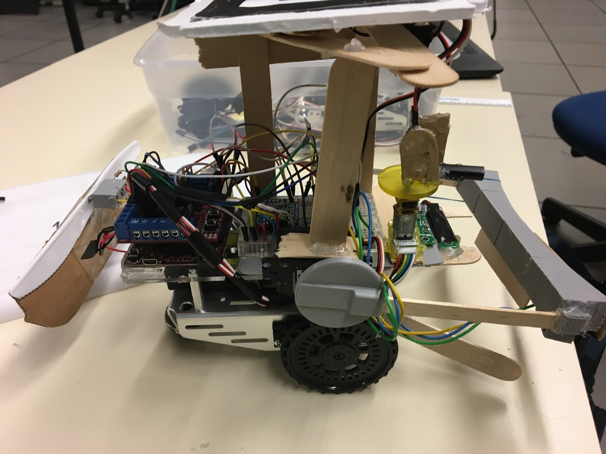

## Authors

- [Jonathan Cochran](https://github.com/ionzzu)
- Cameron Retzlaff

## Background

- Timeline of 5 weeks to build, wire, program, and successfully test a “quidditch” robot
- "Quidditch" is defined as:
    - Rotate the IR Beacon to assign the robot to Team 1 or Team 2
    - If the robot bumps into an obstruction it must recover to keep playing
    - Actively track and catch balls then deposit them on the respective side
    - If a yellow ball, or “snitch,” enters the field, the robot must prioritize catching that ball
    - Must not intentionally damage other robots

## Directory

- [Algorithm](#algorithm)
    - [Tracking](#tracking)
    - [Retrieval](#retrieval)
- [PID Control](#pid-control)
- [Robot Design](#robot-design)

## Algorithm

### Tracking

- Radio transmits position of robot, balls, and other robots on the field
- Designed state machine algorithm to automatically focus robot on the closest ball
- Filters balls that are already retrieved
- Developed algorithm to prioritize capturing a ball within the “golden snitch” hue range
    - Capturing this ball "wins" the game

#### Tracking Diagram

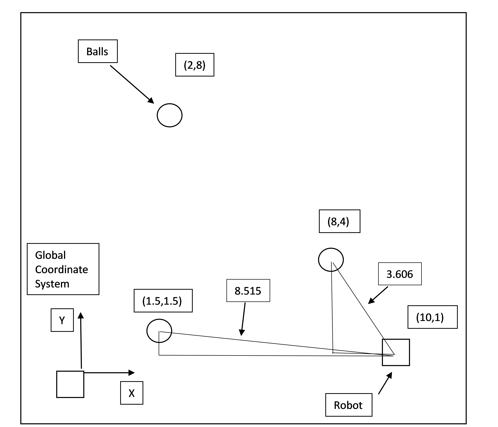

### Retrieval

- Oriented robot and balls in same reference frame with global and robot (local) reference frames
- Determined angle between the robot and ball in the robot’s reference frame
- Developed algorithm to reorient robot's approach angle as it neared a ball
- Detected if ball within capture zone with IR distance sensors
- Closed gate and retrieved ball to home side if ball in capture zone

#### Retrieval Diagram

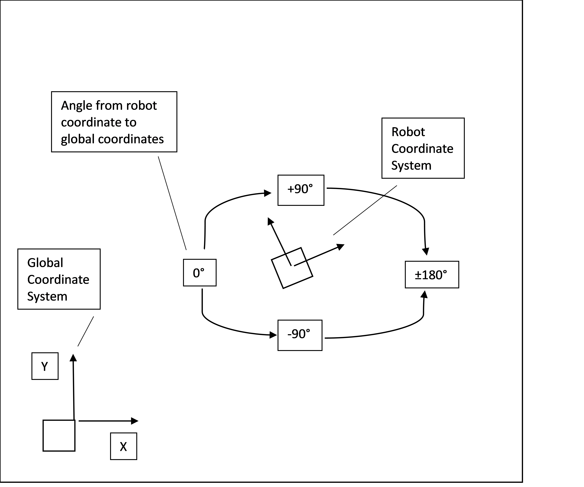

## PID Control

- Required to rotate a DC motor to a precise angle
- Tuned with Ziegler-Nichols method
- Selected PD controller due to fastest rise time and no overshoot
- Resulted in reaching desired angle quickly

#### PI

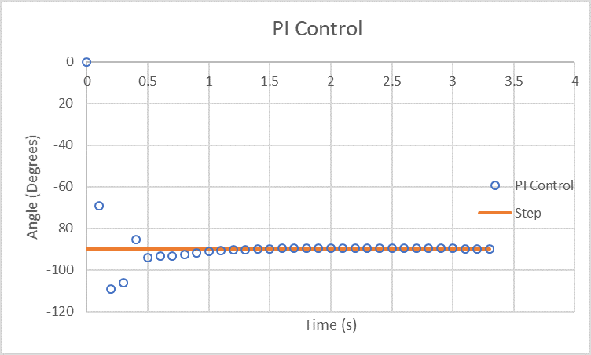

#### PD

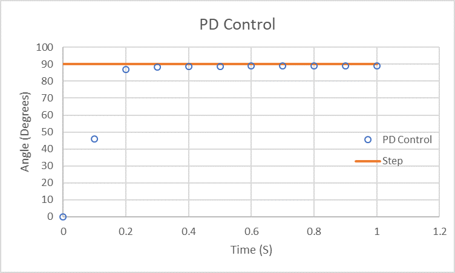

#### PID

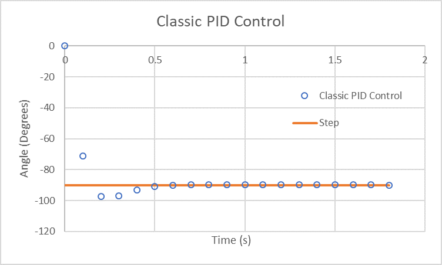

#### "No Overshoot" PID

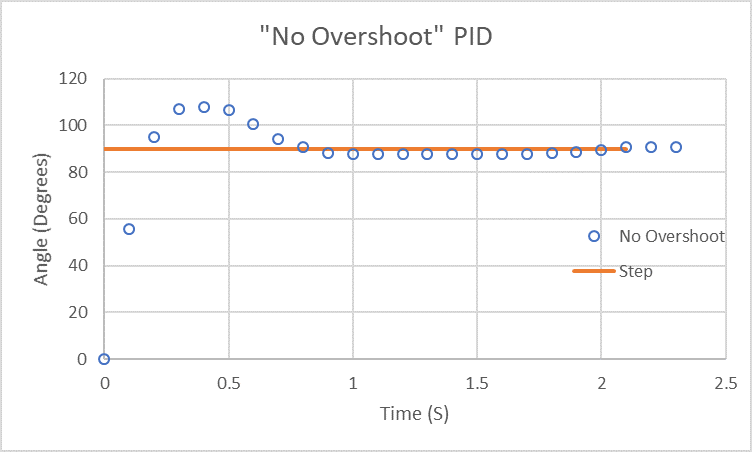

## Robot Design

- Aluminum body frame, two driving wheels, and an unpowered rear drifting wheel
- Capture balls with gate created from 3D printed parts and popsicle sticks
    - Powered by a standard servo motor
- Detect if a ball is within the gate with IR distance sensors
- Impact with obstacles detected by limit switches attached to front and back bumpers
- Detect IR beacon with an IR frequency sensor, rotated with a DC motor
    - Fixed on the front of the robot
- Detect robot with camera above playing field via a unique marker atop the robot
- Broadcast position on playing field via radio to local radio chip on the robot's Arduino board

#### Robot Front View

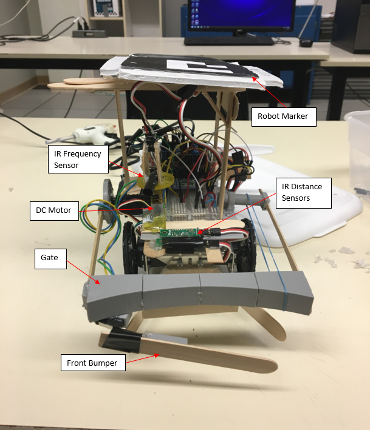

#### Robot Side View

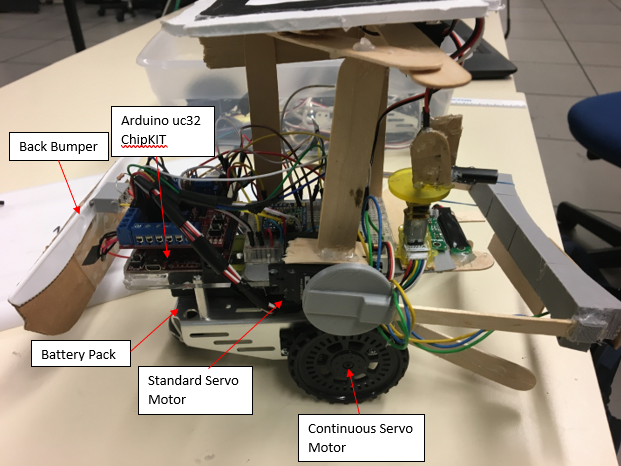

#### Arduino Wiring

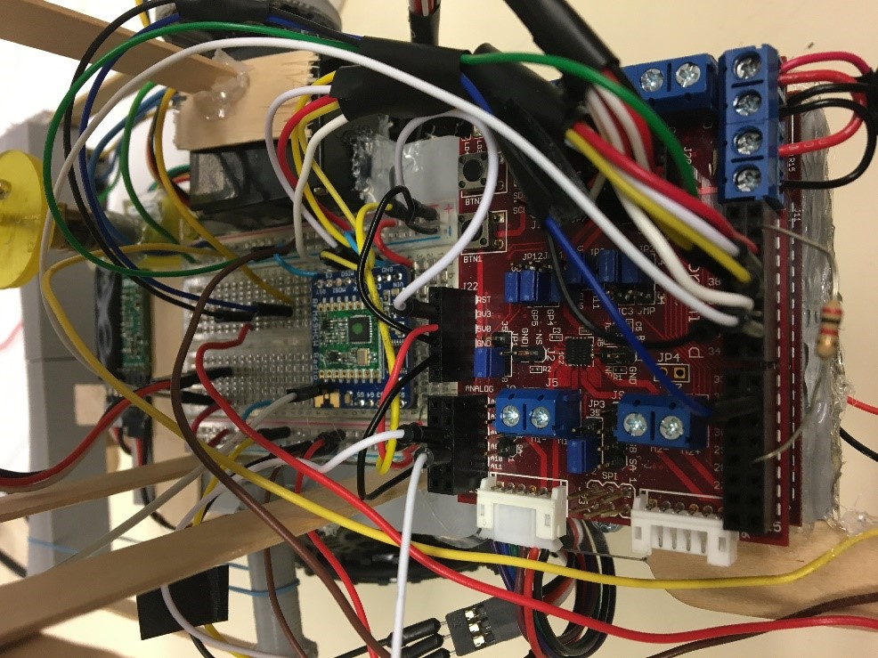

#### 3ft x 3ft Playing Field

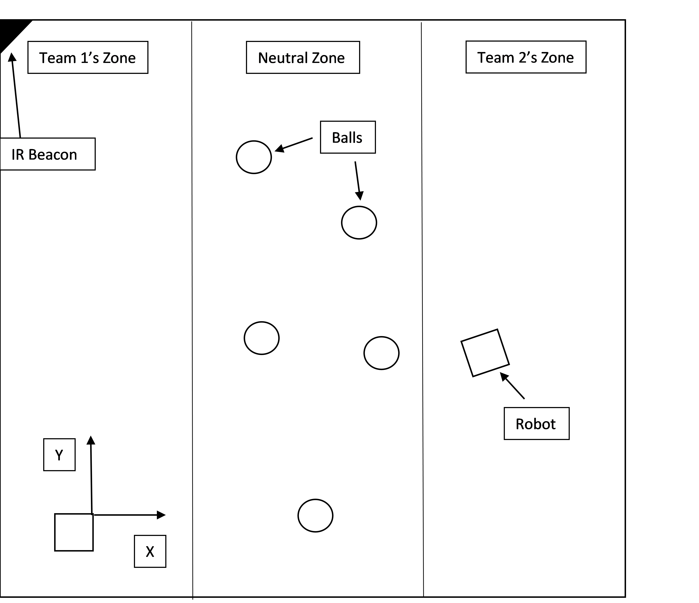
